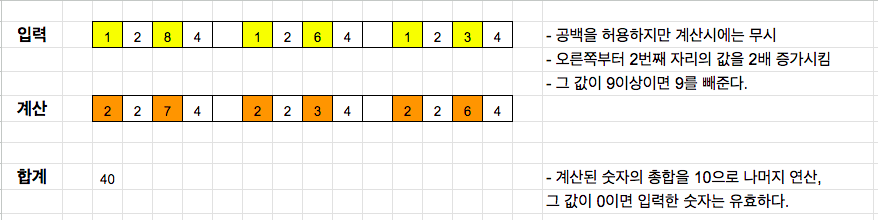

# Luhn

25년 1월 10일

https://exercism.org/tracks/rust/exercises/luhn

[Luhn 공식](https://en.wikipedia.org/wiki/Luhn_algorithm)을 활용하여 다양한 번호(신용카드, 사회보험등)의 유효성을 검증하는 로직을 구현하는 실습 과제다.
### 알고리즘


- 입력값은 공백을 허용하지만 계산시에는 무시해야 하고, 숫자 이외의 문자가 있을 경우 유효한 입력값이 아니다.

이전에 실습한 [Day_8_Minesweeper](Day_8_Minesweeper.md)보다는 쉽다고 생각했지만 또 그렇지도 않았다. 내가 구현한 버전과 커뮤니티 베스트 솔루션과 비교하니 형편없다. 😅

**내 버전**

```rust
/// Check a Luhn checksum.
pub fn is_valid(code: &str) -> bool {
	// sum값을 u64 type으로 설정한 이유는 
	// 테스트값에 999999 99999 999999 999999 99999 처럼 굉장히 큰 값이 있기 때문.
    let mut sum: u64 = 0;
    // filter를 사용하여 공백을 제거했지만 그냥 replace를 사용해도 될 듯.
    let stripped_code: String = code
                                .chars()
                                .filter(|&c| c != ' ')
                                .collect();
    
    if stripped_code.len() <= 1 {
        return false;
    }
    let mut i = 1;
    // 오른쪽부터 계산하라는데 그냥 reverse해서 편한게 하자.
    for s in stripped_code.chars().rev() {
	    // 숫자가 아닌값 체크
	    // is_digit(10)을 사용해도 되지만 is_ascii_digit를 추천한다.
        if !s.is_ascii_digit() {
            return false;
        }
        let num = s.to_digit(10).unwrap() as u64;
        
        if i%2 == 0 {
            // 두번째 자리마다 처리.
            // 두배해서 9이상이면 9를 빼주는 로직 처리 부분.
            let double = num * 2;
            if double >= 9 {
                sum += double - 9;
            } else {
                sum += double;
            }   
        } else {
            sum += num;
        }
        i += 1;
    }
    // 유효성 검증.
    if sum % 10 == 0 {
        return true;
    }
    
    false
}

```

**커뮤니티 베스트 솔루션**

https://exercism.org/tracks/rust/exercises/luhn/solutions/JaneL

아름다운 코드다 !! 💖

```rust
/// Check a Luhn checksum. 
pub fn is_valid(code: &str) -> bool { 
	code.chars()
		.rev()
		.filter(|c| !c.is_whitespace())
		.try_fold((0, 0), |(sum, count), val| { 
			val.to_digit(10)
				.map(|num| if count % 2 == 1 { num * 2 } else { num })
				.map(|num| if num > 9 { num - 9 } else { num }) 
				.map(|num| (num + sum, count + 1)) 
		})
		.map_or(false, |(sum, count)| sum % 10 == 0 && count > 1)
```

is_whitespace(), try_fold(), map_or() 를 이용해서 심플하고 정확하게 구현했다. 👏

Gemini에게 설명을 부탁했다. 😀 

- try_fold() : https://g.co/gemini/share/e4124a7d9a42
- map_or() : https://g.co/gemini/share/22c97ec0b5a2

